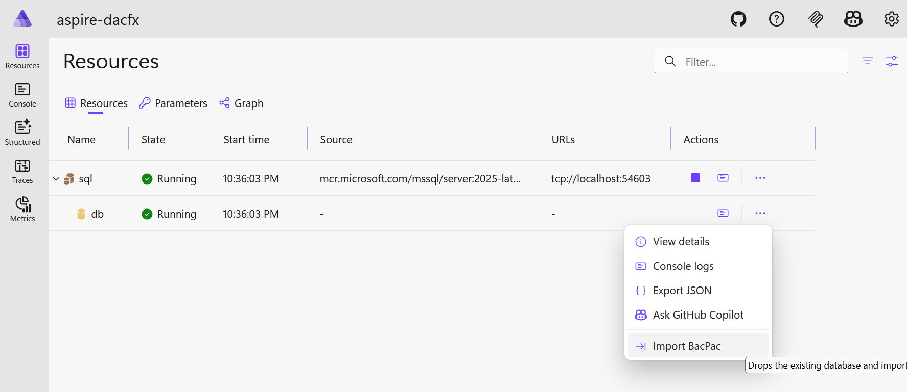

# aspire-dacfx

`aspire-dacfx` is an experimental .NET Aspire AppHost that adds a custom **Import BacPac** command for a SQL Server database resource using DacFX.

When the command runs, it imports a `.bacpac` into the target SQL Server database from the Aspire dashboard command surface.



## Current status

This repository is currently a working prototype.

Important implementation details in the current code:

- The bacpac source path is hardcoded to `D:\downloads\WideWorldImporters-Standard.bacpac`.
- The import target database name is hardcoded to `crashing`.
- The `bacPacFilename` argument passed to `WithBacPacImportCommand(...)` is currently not used by the import logic.

## Prerequisites

- .NET SDK 10.0 or a compatible SDK for `net10.0`
- Docker Desktop (for the Aspire SQL Server container)
- Windows (recommended for the current hardcoded sample path)

## Dependencies

This project uses:

- `Aspire.Hosting.SqlServer` `13.2.2`
- `Microsoft.Data.SqlClient` `7.0.0`
- `Microsoft.SqlServer.DacFx` `170.3.93`

## Quick start

1. Clone the repository.
2. Ensure a bacpac file exists at:

	```text
	D:\downloads\WideWorldImporters-Standard.bacpac
	```

3. Restore and run:

	```bash
	dotnet restore
	dotnet run
	```

4. Open the Aspire dashboard.
5. Locate the `db` SQL database resource.
6. Run the **Import BacPac** command from the resource context actions.

## How it works

At startup, the AppHost configures:

- A SQL Server resource named `sql`
- A SQL database resource named `db`
- A custom command via `WithBacPacImportCommand(...)`

When **Import BacPac** is executed, the current extension implementation:

1. Resolves the target SQL connection string from Aspire resource metadata.
2. Loads the bacpac from the hardcoded local path.
3. Calls DacFX `ImportBacpac(...)` using a hardcoded database name.

## Sample bacpac

You can download the sample WideWorldImporters bacpac from:

- <https://github.com/microsoft/sql-server-samples/releases/tag/wide-world-importers-v1.0>

## Known limitations

- No validation for file existence or path configurability in the command entry point.
- Limited user-facing error reporting (currently primarily debug output).
- Import options are not yet exposed/configurable.
- The richer service implementation exists in the repo, but the active command path currently uses direct DacFX calls in the extension method.

## Development notes

The repository contains two relevant implementation paths:

- `SqlServerDatabaseResourceExtensions.cs`: active command wiring and current import execution path.
- `SqlServerDatabaseImportService.cs`: a more structured service-based import workflow (drop existing DB, import, state notifications), partially wired/commented for future iteration.

## Next improvements (suggested)

- Use the `bacPacFilename` parameter passed into `WithBacPacImportCommand(...)`.
- Add configuration via `appsettings.json` or Aspire parameters instead of hardcoded paths.
- Align imported database name with `target.DatabaseName`.
- Surface progress and failures in Aspire resource state/logs, not only debug output.
- Add documentation for Linux/macOS path handling if cross-platform support is desired.
